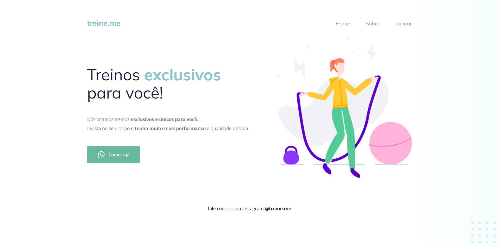

# Corrigindo Bugs 0.2

Desafio disponibilizado pela [Rocketseat🚀](https://www.rocketseat.com.br/) para realizar correção de bugs.

## Como estava o site

Como pode vizualizar o site estava todo bagunçado o layout e com algumas modificações foi deixado de forma mais "limpa".

## Como ficou

## Licensa

Este projeto está sob a licença do MIT. Consulte o arquivo [LICENSE](LICENSE) para obter mais detalhes.